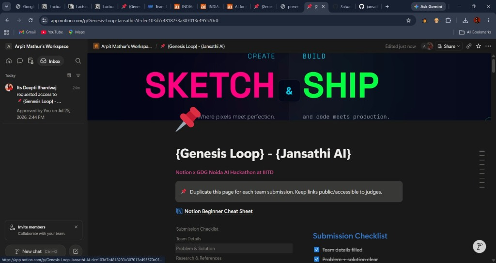
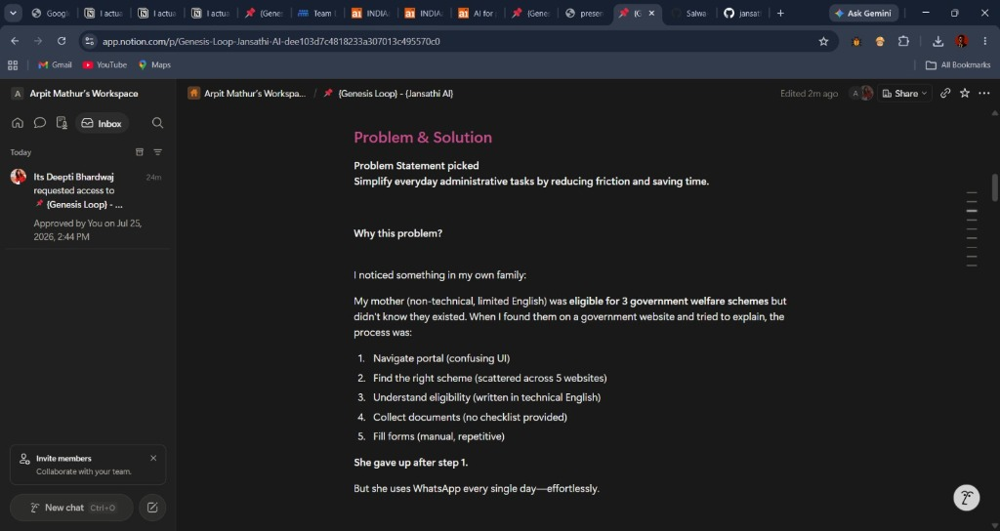
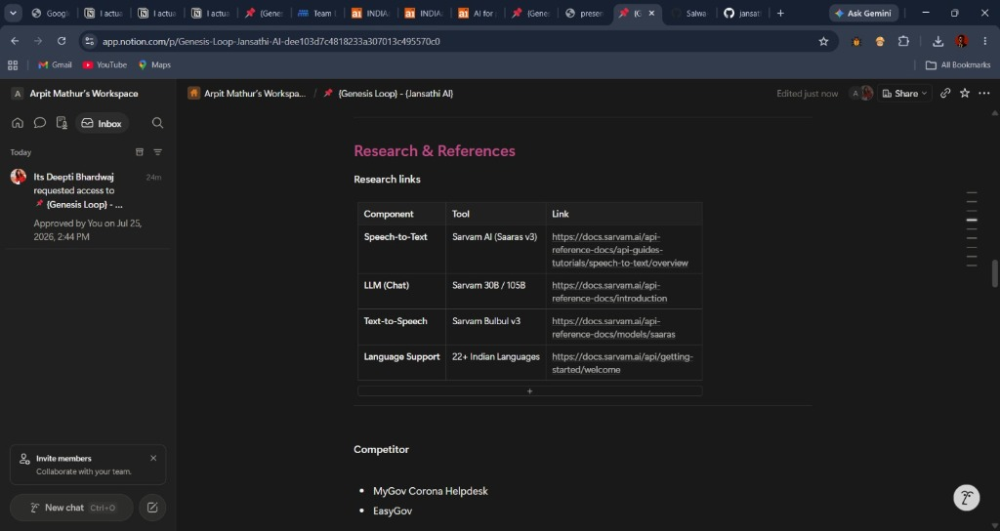
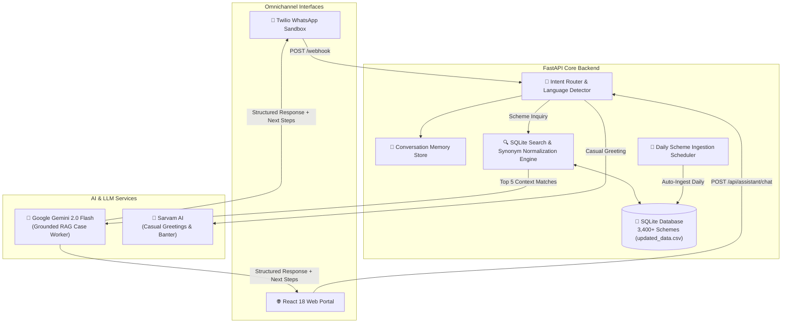

<div align="center">

# 🏛️ JanSathi AI (जनसाथी AI)
### *Empowering Every Indian Citizen Through AI-Powered Public Welfare Assistance*

[](https://python.org)
[](https://fastapi.tiangolo.com)
[](https://react.dev)
[](https://typescriptlang.org)
[](https://ai.google.dev)
[](https://sarvam.ai)
[](https://sqlite.org)
[](https://twilio.com)

<p align="center">
  <b>An omnichannel, zero-hallucination Retrieval-Augmented Generation (RAG) platform & empathetic AI Government Case Worker for 3,400+ Indian Public Welfare Schemes.</b>
</p>

[Explore Dataset](backend/data/updated_data.csv) • [Key Features](#-key-capabilities) • [Architecture](#-system-architecture) • [Getting Started](#-getting-started) • [WhatsApp Integration](#-twilio-whatsapp-sandbox-setup)

</div>

---

## 🌟 Executive Summary

**JanSathi AI** bridges the gap between Indian citizens and complex government bureaucracy. Acting as an empathetic **AI Government Case Worker**, it evaluates citizen eligibility across 10 core domains, asks targeted missing profile questions, retrieves verified schemes from a indexed database of **3,400+ schemes**, and synthesizes step-by-step application guidance in **Hindi (हिंदी)**, **Hinglish**, and **English**.

### 📁 Official Dataset Access
> [!IMPORTANT]
> The full production database is seeded directly from the comprehensive government dataset:
> 🔗 **[Download / View `updated_data.csv` Dataset](backend/data/updated_data.csv)** *(3,400+ schemes featuring scheme details, benefits, eligibility, required documents, level, category, and tags)*.

---

## 📌 Hackathon Submission & Notion Documentation



### 💡 Problem Statement & Real-World Motivation
> *"My mother (non-technical, limited English) was eligible for 3 government welfare schemes but didn't know they existed. When I found them on a government website and tried to explain, she gave up after step 1 due to confusing UI, scattered portals, and complex eligibility technical jargon. But she uses WhatsApp every single day effortlessly."*



### 🔬 Research, AI Tooling & Technical References
- **Speech-to-Text**: Sarvam AI (`Saaras v3`)
- **LLM Chat Engine**: Sarvam 30B/105B & Google Gemini 2.0 Flash
- **Text-to-Speech**: Sarvam Bulbul (`v3`)
- **Language Support**: 22+ Indian Languages
- **Benchmarked Competitors**: MyGov Corona Helpdesk, EasyGov



---

## 💎 Key Capabilities & Unique Features

### 🤖 1. Empathetic AI Government Case Worker Persona
- **Interactive Profile Gathering**: Never dumps raw database text immediately. If crucial profile attributes (State, Qualification, Annual Income, Land, Crop) are missing, it asks targeted follow-up questions first.
- **Structured Recommendations**: For every matched scheme, it generates:
  - ⭐ **Scheme Name**
  - 📌 **Why this scheme matches YOU**
  - 💰 **Benefits Summary**
  - 📄 **Required Documents**
  - 📝 **How to Apply (Step by Step)**
  - 🔗 **Official myScheme Link**
  - 🟢 **Eligibility Match Rating** (High / Medium / Low)
  - 📍 **Actionable Next Steps** (Aadhaar, Income Certificate, CSC visit, Upload, Track)

---

### 🔍 2. 3,400+ Schemes Dataset & Domain Synonym Normalization
- **SQLite Database Indexing**: Pre-loaded, auto-migrated B-Tree indexes on `scheme_name`, `schemeCategory`, and `tags`.
- **Domain Synonym Matching**: Intelligently handles colloquial equivalents:
  - 🎓 **Education**: `12`, `12th`, `Class XII`, `Intermediate`, `10th`, `Scholarships`.
  - 👨‍🌾 **Farmers**: `Farmer`, `Kisan`, `Crop`, `Wheat`, `Rice`, `Land`, `Acres`.
  - 👩 **Women**: `Women`, `Female`, `Mahila`, `Girl`, `Mother`, `Lakhpati Didi`, `SHG`.
  - 👴 **Senior Citizens**: `Senior`, `Elderly`, `Pension`, `Jeevan Pramaan`.
  - 🏥 **Healthcare**: `Hospital`, `Ayushman Bharat`, `Treatment`, `Medical`.
  - 🏠 **Housing**: `House`, `Home`, `PMAY Gramin`, `PMAY Urban`, `Awas`.
  - 💼 **Employment**: `Job`, `Skill Training`, `PMKVY`, `MGNREGA`, `Artisan`.
  - 🏭 **Business**: `Business`, `MSME`, `MUDRA Loan`, `Store`, `Startup`.
  - ♿ **Divyangjan**: `Disability`, `Divyang`, `UDID Card`, `Assistive Aids`.
  - 👶 **Child Welfare**: `Child`, `Orphan`, `Anganwadi`, `Poshan Support`.

---

### 🌐 3. Multilingual Support (Hindi, Hinglish, English)
- **Automatic Language Detection**: Detects Devanagari script, Romanized Hinglish, or English.
- **Language-Matched Output**: Synthesizes responses in the exact language asked by the citizen.

---

### 🔗 4. Verified myScheme Official Links
- **Dynamic Link Generation**: Appends verified official portal links:
  `https://www.myscheme.gov.in/schemes/{slug}`

---

### 🔄 5. Automated Daily Scheme Collector & Scheduler
- **24-Hour Background Ingestion**: Non-blocking background scheduler (`scheduler.py`) that auto-ingests newly released schemes.
- **Admin Portal Sync**: Features a live status card and manual **"Sync Latest Schemes Now"** button on `/admin`.

---

### 📱 6. Omnichannel WhatsApp & React Web Portal (Single ngrok Deployment)
- **WhatsApp Integration**: Live chat via Twilio WhatsApp Sandbox (`POST /webhook/incoming`).
- **Production React Web UI**: FastAPI serves the built React web application (`frontend/dist`) on the root URL, allowing a single ngrok URL to host both WhatsApp Webhook & Mobile Web Portal.
- **Interactive Reminders**: Allows citizens to schedule application deadline reminders and track completion.

---

## 🏗️ System Architecture



---

## 🗂️ Project Structure

```
jansathi-ai/
├── frontend/
│   ├── src/
│   │   ├── components/     # Layout, Navbar, Footer, Toast
│   │   ├── pages/          # Landing, Chat, Reminders, Admin, NotFound
│   │   ├── services/       # API Axios Client & Scheme Services
│   │   ├── App.tsx         # React Router Configuration
│   │   └── index.css       # Saffron, Navy & Emerald Design System
│   ├── dist/               # Built Production Web Bundle
│   ├── package.json
│   └── vite.config.ts
├── backend/
│   ├── data/
│   │   └── updated_data.csv # 3,400+ Government Schemes Dataset
│   ├── app/
│   │   ├── main.py         # FastAPI App & React Static File Server
│   │   ├── config.py       # Pydantic Settings Configuration
│   │   ├── database.py     # SQLite Connection & Session Manager
│   │   ├── seed.py         # Dataset Import, Migration & B-Tree Indexer
│   │   ├── routers/        # Health, Citizens, Schemes, Reminders, Assistant, Webhook
│   │   ├── services/       # Gemini RAG, Sarvam AI, Search Engine, Scheme Collector, Scheduler
│   │   └── models/         # SQLAlchemy Database Models (Scheme, Citizen, Reminder)
│   ├── main.py             # Uvicorn Application Entrypoint
│   └── requirements.txt
└── README.md
```

---

## 🚀 Getting Started

### Prerequisites
- **Python**: `3.10` or higher
- **Node.js**: `18.x` or higher
- **ngrok**: installed on system

---

### 1. Backend Installation & Startup
```powershell
cd backend
python -m venv venv
.\venv\Scripts\activate
pip install -r requirements.txt

# Start FastAPI Server
.\venv\Scripts\python.exe -m uvicorn app.main:app --host 127.0.0.1 --port 8000 --reload
```
- **API Documentation**: [http://127.0.0.1:8000/docs](http://127.0.0.1:8000/docs)
- **Health Check**: [http://127.0.0.1:8000/health](http://127.0.0.1:8000/health)

---

### 2. Frontend Installation & Build
```powershell
cd frontend
npm install
npm run build
```
*(FastAPI automatically serves the built React web application directly from `frontend/dist` on `http://127.0.0.1:8000/`)*.

---

### 3. Exposing via ngrok
```powershell
ngrok http 8000
```
*Forwarding Example*: `https://ceroplastic-evaluative-emeline.ngrok-free.dev -> http://localhost:8000`

---

## 📱 Twilio WhatsApp Sandbox Setup

1. Open **[Twilio Console -> WhatsApp Sandbox Settings](https://console.twilio.com/us1/develop/sms/settings/whatsapp-sandbox)**.
2. Under **"WHEN A MESSAGE COMES IN"**, enter your ngrok Webhook URL:
   ```text
   https://<your-ngrok-domain>.ngrok-free.dev/webhook/incoming
   ```
3. Set Method to **`HTTP POST`** and click **Save**.
4. Send your sandbox join code (e.g. `join river-tall`) to `+1 415 523 8886`.
5. Start chatting live with **JanSathi AI** on WhatsApp!

---

## 🧪 Sample Test Queries

| Language | Category | Sample Prompt |
| :--- | :--- | :--- |
| **Hinglish** | 🎓 Student | `Main UP se Class 12th 85% marks se pass hua hun, family income 2 lakh hai. Scholarship batayein.` |
| **Hindi** | 👨‍🌾 Farmer | `मेरे पास 3 एकड़ खेती की ज़मीन है, मुझे फसल सहायता योजना की जानकारी दीजिए।` |
| **Hinglish** | 👩 Women | `Main tailoring micro-business start karna chahti hun, Lakhpati Didi yojana ke baare me batao.` |
| **English** | 👴 Senior | `I am 70 years old with a BPL card seeking senior citizen pension.` |
| **Hinglish** | 🏥 Health | `Mere parivar ko Ayushman Bharat hospital treatment cover chahiye.` |

---

<div align="center">

Made with ❤️ for Public Welfare & Citizen Empowerment across India.

</div>
